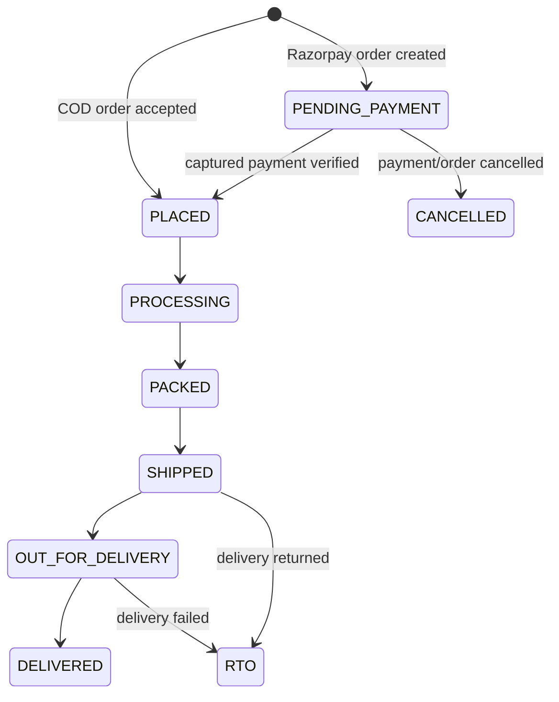

# Orders and payments

This folder is the reference for the order checkout implementation. It describes the current database contract, API, payment checks, and order lifecycle.

## Overview

The browser submits a payment method and either a new delivery address or an address saved to the user's account. New addresses are saved automatically and repeated exact matches are reused. The backend identifies the user from the authenticated cookie, reads that user's cart, rechecks stock, calculates prices from current product data, and snapshots the items and address in the database. Client-supplied prices and totals are ignored because they are not accepted by the request schema.

For Razorpay, the backend creates a local pending order, creates a Razorpay Order using the server-side API credentials, and returns the Razorpay order ID and public key ID to Checkout. After Checkout returns, the backend verifies the HMAC signature, fetches the payment from Razorpay, and checks its order ID, amount, currency, and captured status before marking the local order placed and clearing the cart.

For cash on delivery (COD), the backend creates the order in `PLACED` state and clears the cart in the same database transaction. The payment remains `pending` until COD collection is implemented.

## Order lifecycle



Order status tracks fulfilment. Payment status is independent:

| Payment status | Meaning |
|---|---|
| `pending` | Payment is not confirmed. This is used for both new Razorpay and COD orders. |
| `success` | Razorpay reports the payment as captured and server verification passed. |
| `failed` | The payment or Razorpay order setup failed. |
| `refunded` | A refund was recorded; refund processing is not implemented yet. |

Customers can request a return after delivery. The request is recorded as `RETURN_REQUESTED`; staff review, pickup, approval/rejection, and refunds are not automated. Return requests currently apply to the whole order.

## Database fields

Migration `000009_order_checkout` upgrades the existing order/payment tables. Money is stored in INR decimal amounts in PostgreSQL and sent to Razorpay as integer paise (`₹1.00` is `100`).

Migration `000010_saved_addresses` adds saved customer delivery addresses. Orders keep their own address snapshot, so editing/deleting a saved address later will not rewrite past order details.

### `orders`

| Field | Purpose |
|---|---|
| `id` | Local order identifier returned to the client. |
| `user_id` | Authenticated owner; never accepted from the request. |
| `status` | Fulfilment lifecycle state. Starts at `PENDING_PAYMENT` for Razorpay and `PLACED` for COD; eligible customer cancellations change it to `CANCELLED`. |
| `return_status` | Optional return lifecycle. A delivered order can be marked `RETURN_REQUESTED`. |
| `subtotal_amount` | Sum of item list prices before discounts. |
| `discount_amount` | Difference between subtotal and payable total. |
| `total_amount` | Amount charged or due, calculated by the backend. |
| `currency` | Currency code used for the order and gateway request (`INR`). |
| `shipping_full_name`, `shipping_phone` | Recipient information captured at checkout. |
| `shipping_line1`, `shipping_line2` | Address snapshot for this order. |
| `shipping_city`, `shipping_state`, `shipping_postal_code`, `shipping_country` | Address fields needed to deliver the order. |
| `created_at`, `updated_at` | Creation and last-update times. |

### `order_items`

| Field | Purpose |
|---|---|
| `order_id` | Parent order. |
| `product_id` | Product reference for internal reporting. |
| `product_name` | Name snapshot, so later product edits do not rewrite order history. |
| `quantity` | Units purchased. |
| `unit_price` | Per-unit selling price at checkout. |
| `discounted_unit_price` | Per-unit amount actually used in the order total. |
| `created_at` | Item snapshot creation time. |

### `payments`

| Field | Purpose |
|---|---|
| `order_id`, `user_id` | Connect the payment to its order and owner. |
| `method` | `RAZORPAY` or `COD`. Razorpay's individual card/UPI choice remains with Razorpay. |
| `status` | Payment lifecycle, independent of order fulfilment. |
| `amount` | Expected amount, matching the order total. |
| `razorpay_order_id` | Gateway order ID used to bind Checkout to this local order. |
| `razorpay_payment_id` | Gateway payment ID returned from Checkout and verified by the backend. |
| `razorpay_signature` | Checkout signature retained for audit after server verification. |
| `remarks` | Gateway setup failure detail; never stores API credentials. |
| `created_at`, `updated_at` | Payment record timestamps. |

### `saved_addresses`

| Field | Purpose |
|---|---|
| `id` | Address identifier used at checkout. |
| `user_id` | Owner, derived from authentication on reads and writes. |
| `full_name`, `phone` | Delivery recipient and contact number. |
| `line1`, `line2` | Street/building and optional unit/landmark. |
| `city`, `state`, `postal_code`, `country` | Delivery locality. |
| `created_at`, `updated_at` | Address creation/update times. |

## API contract

All endpoints below require the existing authenticated `access_token` cookie.

### List the signed-in user's orders

`GET /api/v1/orders`

Returns an array ordered newest first. Every row is scoped to the authenticated user and includes item name/price snapshots.

```json
[
  {
    "orderId": 123,
    "status": "SHIPPED",
    "paymentStatus": "success",
    "paymentMethod": "razorpay",
    "totalAmount": 1250.00,
    "currency": "INR",
    "createdAt": "2026-09-27T10:00:00Z",
    "items": [
      { "productName": "Rudraksha Mala", "imageURL": "/uploads/mala.jpg", "quantity": 1, "unitPrice": 1250.00, "amount": 1250.00 }
    ]
  }
]
```

`status` shows fulfilment progress; `paymentStatus` is independent. Item `amount` is the discounted per-unit checkout price; multiply it by `quantity` for that line total.
`returnStatus` is included once a return has been requested.

### Retry an unpaid Razorpay order

`POST /api/v1/orders/{orderId}/retry-payment`

Returns the existing Razorpay order ID, public key ID, and amount in paise so Checkout can be reopened. It is available only while the local order is `PENDING_PAYMENT` and its Razorpay payment is still `pending`.

### Cancel an order

`POST /api/v1/orders/{orderId}/cancel`

Cancels the full order when Razorpay payment is still pending, or when it is a COD order that has not been collected. The response is `{ "orderId": 123, "status": "CANCELLED" }`. Successful Razorpay payments cannot be cancelled here because refunds are not integrated.

### Request a return

`POST /api/v1/orders/{orderId}/return`

Available after the order reaches `DELIVERED`, and records `return_status: "RETURN_REQUESTED"`. This requests a return for the whole order. It does not approve the request, arrange pickup, or issue a refund. No return-window duration is configured yet.

### List saved delivery addresses

`GET /api/v1/addresses`

Returns the signed-in user's saved addresses, newest created first:

```json
[
  {
    "id": 7,
    "fullName": "Asha Sharma",
    "phone": "9876543210",
    "line1": "12 Temple Road",
    "line2": "Apartment 4",
    "city": "Pune",
    "state": "Maharashtra",
    "postalCode": "411001",
    "country": "IN"
  }
]
```

### Create an order

`POST /api/v1/orders`

Request:

```json
{
  "paymentMethod": "razorpay",
  "shippingAddress": {
    "fullName": "Asha Sharma",
    "phone": "9876543210",
    "line1": "12 Temple Road",
    "line2": "Apartment 4",
    "city": "Pune",
    "state": "Maharashtra",
    "postalCode": "411001",
    "country": "IN"
  }
}
```

For an address already returned by `GET /api/v1/addresses`, send its ID instead of the address object:

```json
{ "paymentMethod": "cod", "shippingAddressId": 7 }
```

Exactly one of `shippingAddress` and `shippingAddressId` is required. A new address is saved to the account as part of order creation and can be selected at the next checkout. A saved ID is only usable by its owner.

| Request field | Required | Purpose |
|---|---:|---|
| `paymentMethod` | Yes | `razorpay` starts online checkout; `cod` places a cash-on-delivery order. |
| `shippingAddress` | One of address object or ID | Provide a new address (saved automatically), or reuse one previously saved. |
| `shippingAddressId` | One of address object or ID | Existing saved address ID owned by the signed-in user. |
| `shippingAddress.fullName` | When using a new address | Name on the delivery. |
| `shippingAddress.phone` | When using a new address | Contact number for delivery. |
| `shippingAddress.line1` | When using a new address | Main street/building address. |
| `shippingAddress.line2` | No | Optional flat, unit, or landmark. |
| `shippingAddress.city` | When using a new address | Delivery city. |
| `shippingAddress.state` | When using a new address | Delivery state/region. |
| `shippingAddress.postalCode` | When using a new address | Delivery postal code. |
| `shippingAddress.country` | When using a new address | Two-letter country code. |

Do not add a client amount, user ID, or cart item list to this request. The backend calculates the total from the user's current cart.

Razorpay response:

```json
{
  "orderId": 123,
  "status": "PENDING_PAYMENT",
  "paymentStatus": "pending",
  "paymentMethod": "razorpay",
  "amount": 125000,
  "currency": "INR",
  "razorpayOrderId": "order_example",
  "razorpayKeyId": "rzp_test_example"
}
```

COD returns the same local order/payment fields with `status: "PLACED"`, `paymentMethod: "cod"`, and without Razorpay-specific fields. `amount` in either response is integer paise for consistent currency representation.

### Verify a Razorpay payment

`POST /api/v1/orders/{orderId}/payment/verify`

Request:

```json
{
  "razorpayOrderId": "order_example",
  "razorpayPaymentId": "pay_example",
  "razorpaySignature": "64-character-hex-signature"
}
```

| Field | Purpose |
|---|---|
| `razorpayOrderId` | Must match the gateway order saved against this local order. |
| `razorpayPaymentId` | Lets the backend fetch the payment directly from Razorpay. |
| `razorpaySignature` | HMAC proof returned by Checkout; the backend validates it with the API secret. |

Success response:

```json
{
  "orderId": 123,
  "status": "PLACED",
  "paymentStatus": "success"
}
```

The backend checks the signature for `razorpay_order_id + "|" + razorpay_payment_id`, then fetches the payment from Razorpay and verifies the payment's order ID, amount, currency, and `captured` status. The API secret is server-only. See [Razorpay's Orders API](https://razorpay.com/docs/api/orders/create/) and [signature verification guidance](https://razorpay.com/docs/server-integration/python/test-app/).

Enable automatic payment capture for the Razorpay account used by the app. This flow deliberately accepts only `captured` payments; an `authorized` payment is not treated as a placed order.

## Configuration and local setup

Add these values to `backend/.env` using Razorpay **Test Mode** credentials while developing:

```dotenv
RAZORPAY_KEY_ID=rzp_test_...
RAZORPAY_KEY_SECRET=...
```

Never put `RAZORPAY_KEY_SECRET` in frontend environment variables or commit it. The public key ID is returned by the backend only to initialize Checkout.

From `backend/`, run migrations and start the API:

```sh
go run cmd/server/main.go
```

The database URL and migration path must already be configured as described by the backend setup. The server applies pending migrations on startup. If the database is still marked dirty at migration version 7 from the earlier syntax error, first repair the migration version as described in the root conversation/setup; do not force a version on a database with partially applied DDL without inspecting it.

## Current boundaries

- Razorpay checkout and server-side payment verification are implemented; payment webhooks and automatic reconciliation are not. If Checkout succeeds but the browser closes before calling the verify endpoint, the local order may remain `PENDING_PAYMENT` and require reconciliation.
- Staff delivery-status transition endpoints and a scheduled payment timeout are not implemented yet. A failed Razorpay order-creation request is marked `CANCELLED`; a customer closing Checkout leaves its local order `PENDING_PAYMENT`, where they can retry payment.
- Stock is checked against current product quantity when creating an order, but stock is not reserved while a Razorpay payment is pending and is not decremented by this checkout flow yet. Concurrent orders can therefore oversell limited stock; add reservation/capture handling before production use.
- COD orders are placed immediately and the cart is cleared; COD collection and marking the payment successful are not implemented.
- Customer cancellation is limited to unpaid orders and uncollected COD orders. Return requests are recorded for delivered orders, but review, return windows, pickup, and refunds are not implemented. Tax and shipping charges are outside this flow.
